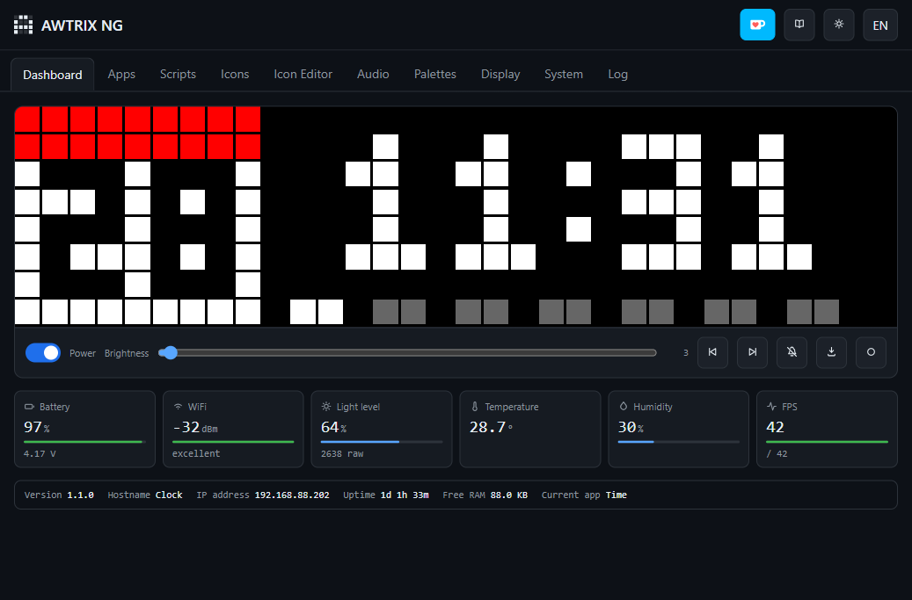

# PSAwtrixNG 

> [!NOTE]
> **Inspired by Frank Lindenblatt at PSConfEU.**
> This project grew from Frank's Posh-a-Kucha session and the possibilities he
> demonstrated with an Ulanzi smart clock and PowerShell.
> [Watch the session recording on YouTube](https://www.youtube.com/watch?v=8i62QL7lgBA).

`PSAwtrixNG` is a PowerShell module for managing and automating
[AWTRIX NG](https://github.com/Blueforcer/awtrix-ng) devices, especially the
ESP32-based Ulanzi TC001 smart pixel clock.

`PSAwtrixNG` follows the move from AWTRIX 3 to AWTRIX NG, whose rewritten
firmware provides a new HTTP API, MQTT integration, and on-device Berry
scripting.

> [!IMPORTANT]
> The Ulanzi TC002 is not compatible. It is a Linux device built from different
> components, not an ESP32-based TC001, and cannot run the AWTRIX NG firmware
> targeted by this module.

## AWTRIX NG and PowerShell

AWTRIX NG already provides a capable standalone clock. Its built-in web
interface includes a live display preview, app navigation, brightness and power
controls, scripts, icons, an icon editor, audio, palettes, display settings,
system configuration, logs, backup and update features.



The firmware can rotate built-in apps, display pushed cards and notifications,
run Berry scripts directly on the clock, communicate over HTTP and MQTT, and
keep working without a PowerShell process connected.

`PSAwtrixNG` makes those capabilities scriptable and composable from
PowerShell. It lets you:

- Inspect device health, settings, applications, capabilities, storage, and
  the current screen.
- Mirror the live 32x8 matrix in a terminal, once or continuously.
- Send notifications and create pushed app cards with text, colors, icons, and
  animations.
- Read, set, increase, or decrease brightness using percentages.
- Control display power, app selection, and automatic app rotation.
- Upload, download, list, and remove icons and other device files.
- Install, configure, activate, retrieve, and remove Berry scripts.
- Install an on-device stopwatch controlled by buttons, HTTP, or MQTT.
- Start an in-process MQTT broker and publish or capture AWTRIX messages.
- Preview state-changing commands with PowerShell's `-WhatIf`.

### Terminal view

`Show-AwtrixScreen` renders the clock's current pixels using ANSI true color
where supported. `Watch-AwtrixScreen` keeps the same terminal area synchronized
with the physical display.


```powershell
Show-AwtrixScreen -Device $clock
Watch-AwtrixScreen -Device $clock -DurationSec 60
```

## Bootstrap an Ulanzi TC001

Flashing firmware changes the device and can erase its settings. Read the
official [AWTRIX NG flashing guide](https://blueforcer.github.io/awtrix-ng/getting-started/flashing/)
before starting.

1. **Back up the original TC001 firmware.** Use `esptool` to read the complete
   4 MB flash if you may want to restore the factory firmware later.
2. **Connect the TC001 with a USB data cable.** A charge-only cable will not
   expose its serial port.
3. **Flash AWTRIX NG.** The simplest method is the official browser flasher in
   desktop Chrome, Edge, or Opera. For a manual fresh install, use the
   `usb-awtrix-ng-4mb.bin` image from the
   [AWTRIX NG releases](https://github.com/Blueforcer/awtrix-ng/releases).
4. **Join the temporary AWTRIX access point.** A fresh device displays
   `AP MODE`. Connect to its open Wi-Fi network and browse to
   `http://192.168.4.1` if the setup page does not open automatically.
5. **Configure Wi-Fi and reboot.** AWTRIX joins the network and scrolls its IP
   address across the matrix. Open that address to reach the web interface.
6. **Install this PowerShell module and connect to the clock.**

Install the latest preview from PowerShell Gallery:

```powershell
Install-PSResource -Name PSAwtrixNG -Prerelease
Import-Module -Name PSAwtrixNG
```

An existing AWTRIX NG installation can be updated with its OTA image after
reviewing the release and downloading the correct `.bin` file:

```powershell
$updateParameters = @{
    Device              = $clock
    Path                = '.\firmware-awtrix-ng.bin'
    AllowFirmwareUpdate = $true
    WhatIf              = $true
}

Update-AwtrixFirmware @updateParameters
```

Remove `-WhatIf` only after verifying the exact image. The command rejects
`usb-*` full-flash images, requires high-impact confirmation, uploads the OTA
image, and then the device reboots.

Create a reusable device connection and verify it with read-only commands:

```powershell
$clock = New-AwtrixDevice -HostName '192.168.1.50' -Name DeskClock

Get-AwtrixStatus -Device $clock
Get-AwtrixBrightness -Device $clock
Show-AwtrixScreen -Device $clock
```

If authentication is enabled in the AWTRIX web interface:

```powershell
$clock = New-AwtrixDevice -HostName 'clock.local' -Credential (Get-Credential)
```

## Try it

Send a notification:

```powershell
Send-AwtrixNotification -Device $clock -Text 'Hello from PowerShell'
```

Create a card using an icon bundled with the module:

```powershell
$module = Get-Module -Name PSAwtrixNG
$assetPath = Join-Path -Path $module.ModuleBase -ChildPath 'Assets\powershell.gif'
$icon = Set-AwtrixIcon -Device $clock -Path $assetPath

$card = [AwtrixApp] @{
    text      = 'Build passed'
    textColor = '#00FF00'
    icon      = $icon.Id
}

Set-AwtrixPushedApp -Device $clock -Name build -App $card
Select-AwtrixApp -Device $clock -Name build
```

Adjust brightness and pause app rotation:

```powershell
Set-AwtrixBrightness -Device $clock -Level 50
Set-AwtrixBrightness -Device $clock -Increase 10
Disable-AwtrixAppRotation -Device $clock
Enable-AwtrixAppRotation -Device $clock
```

Install and display the standalone stopwatch:

```powershell
Install-AwtrixStopwatch -Device $clock
Select-AwtrixApp -Device $clock -Name Stopwatch
```

All state-changing commands support `-WhatIf` where applicable:

```powershell
Send-AwtrixNotification -Device $clock -Text 'Preview only' -WhatIf
```

## Documentation

- [Getting started](source/WikiSource/Getting-Started.md)
- [HTTP API examples](source/WikiSource/HTTP-API.md)
- [MQTT and the PowerShell broker](source/WikiSource/MQTT.md)
- [Berry scripts](source/WikiSource/Berry-Scripts.md)
- [Icons, files, and storage](source/WikiSource/Icons-and-Files.md)
- [Safety and testing](source/WikiSource/Safety-and-Testing.md)
- [AWTRIX NG documentation](https://blueforcer.github.io/awtrix-ng/)

## Development

The project uses [Sampler](https://github.com/gaelcolas/Sampler) for dependency
resolution, building, testing, documentation, packaging, and publishing.

```powershell
.\build.ps1 -ResolveDependency -Tasks noop
.\build.ps1 -Tasks build
.\build.ps1 -Tasks test
.\build.ps1 -Tasks docs
```

GitHub Actions tests PowerShell 7 on Windows, Linux, and macOS, Windows
PowerShell 5.1, and the module quality checks. Successful pushes to `main`
publish a preview release. Stable releases are published only for tags matching
`v1.2.3`.

## Acknowledgements

- [Frank Lindenblatt](https://www.youtube.com/watch?v=8i62QL7lgBA), whose
  Posh-a-Kucha session at PSConfEU sparked the original project idea.
- [Blueforcer](https://github.com/Blueforcer) and the AWTRIX contributors for
  AWTRIX 3, AWTRIX NG, and the ecosystem around these small displays.
- GitHub Copilot, which helped extensively with research, implementation,
  testing, documentation, and the many rounds of pixel-art refinement.

## License

This PowerShell module is licensed under the [MIT License](LICENSE). AWTRIX NG
is a separate project distributed under the
[PolyForm Noncommercial 1.0.0 license](https://github.com/Blueforcer/awtrix-ng/blob/main/LICENSE.md).
